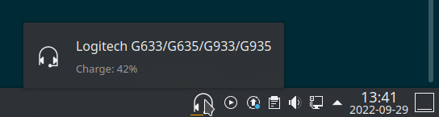

# plasmoid-headsetcontrol

A simple KDE Plasma widget using https://github.com/Sapd/HeadsetControl that
shows your headset's current battery status in the task bar and allows you to
control some of its features.



Hovering over the widget's icon will display the current charge. Clicking it
will open a pop-up letting you control some of the headset's features, if
supported.

The widget's icon itself will display various hints about the headset's status,
such as:

* Unavailable (no headset currently connected).
* Plugged in and charging.
* Current charge level (if not charging) as a colored line beneath the icon.

## Requirements

This widget requires HeadsetControl to be installed and accessible. Please
follow HeadsetControl's [building instructions](https://github.com/Sapd/HeadsetControl#building)
for compiling, installing, and giving the proper permissions to the binary.

This also means that support is limited to the models that HeadsetControl
supports. See [the list on their repo](https://github.com/Sapd/HeadsetControl#supported-headsets)
for more details.

## Installation

You can either install a pre-packaged release available in this repository, or
do it directly from source.

### Using a release

1. Download the latest release from this repository.
2. In your Plasma session, right-click a panel and select `Add Widgets...`
3. Click the `Get new widgets` button in the Widget Explorer that just opened.
4. Select the `Install Widget From Local File...` option.
5. Browse to where you downloaded `headsetcontrol.plasmoid` and click `Finish`.

### From source

This requires the `kpackagetool5` binary (available in Ubuntu as the eponymous
`kpackagetool5` package, your distro may vary).

```sh
git clone https://github.com/lazy-stripes/plasmoid-headsetcontrol
cd plasmoid-headsetcontrol
kpackagetool5 -t Plasma/Applet --install package
```

If this is not your first installation, use the following command instead:

```sh
kpackagetool5 -t Plasma/Applet --upgrade package
```

## Configuration

To work, the plasmoid needs to know the path to your HeadsetControl binary. If
you installed it to the default location (`/usr/local/bin/headsetcontrol`) then
it should work out of the box.

Otherwise, after installing the plasmoid, right click it and select the
`Configure Headset Control...` option.

In the configuration dialog that appears, you can indicate the full path to your
HeadsetControl binary, as well as how often you want it called to refresh the
widget's status.

## Limitations

This widget is only a thin wrapper around HeadsetControl and may break if you
look at it funny.

It was also only tested with my Logitech G935 and G533 headsets, so some
features may not work.

## Acknowledgements

All the heavy lifting is done by [HeadsetControl](https://github.com/Sapd/HeadsetControl). If this is useful to you in any way, please consider sponsoring
that project.